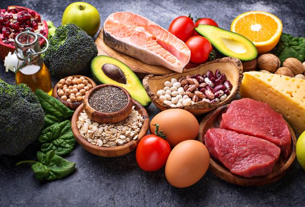

# Exploring Nutrition with STEAM

## Unit 1

### Lesson 1 - What is Nutrition? 🍎

#### Instructions:

For this lesson you will need your nutrition notebook. On a blank page, write Lesson 1 - What is Nutrition?

Then read the following information. Watch any videos by clicking on the links. Answer all questions in your nutrition notebook.

#### Discussion:

**Nutrition** is: the branch of science that deals with *nutrients* and how we get and use them, particularly in humans. 

**A nutrient** is: a substance that *provides nourishment* essential for growth and the maintenance of life. 💪

**Nutrients** are found in **food**. 

Take a look at the picture below. 👇

Do you recognize some of these **foods**?

All **foods** contain different types and amounts of **nutrients**.

What are examples of **nutrients**?

* Protein
* Fats
* Carbohydrates
* Calcium
* Vitamin C
* Water
* Vitamin D

✍️Can you think of any nutrients not on this list? Write down your ideas in your *nutrition notebook*. 

***Great job!*** 

#### Watch this video:

Once you have written down at least 3 examples of nutrients, watch this video to learn more about nutrients. Pay close attention. 🤓 There will be a short quiz after you watch the video. Take notes in your notebook to help you with the quiz.

[All About Nutrition](https://www.youtube.com/watch?v=uYamwNVnCVU)

#### Quiz time!

Show what you know about nutrition by taking this short quiz as your exit ticket for the day.👍

[Nutrition Basics Quiz](https://forms.gle/ZpJNRTVdMgSgfMxm6)

#### Draw your thoughts:

Once you are finished with the quiz, take a few minutes to draw a picture or two in your notebook to remind you of what you learned today.

In our next lesson, we will learn about *calories* and why they are important. 

See you next time! 👋
